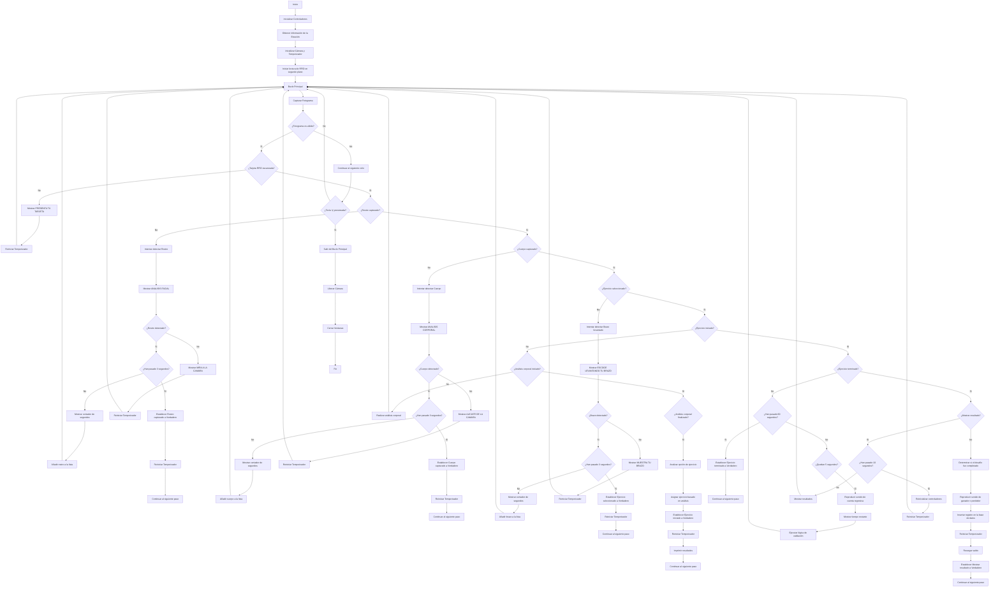

# Mi Rutina

Es un sistema que incentiva la actividad física y combate la contaminación recompensando a los usuarios con pasajes de transporte público por completar rutinas de ejercicio. Utiliza visión por computadora (detección facial y corporal) para validar los ejercicios y una plataforma web para la gestión de usuarios e historial. Busca mejorar la salud y la sostenibilidad urbana.

## Objetivos Principales

* Mejorar la salud de los usuarios.

* Promover la actividad física.

* Reducir el uso de transporte privado.

## Problemática

Combate el sedentarismo y la contaminación causada por el uso excesivo de vehículos personales.

## Beneficios Clave

Mejora la salud, reduce el tráfico y la contaminación, fomenta hábitos activos y es accesible.

## Metodología y Tecnología

Desarrollado con metodología ágil (Scrum y Kanban) y un enfoque MVC. Tecnologías clave incluyen:

* **Visión por Computadora:** CNN, Haar Cascades, MediaPipe para detección y validación de ejercicios.

* **Backend:** Spring Boot (Java).

* **Frontend:** Angular (Typescript).

* **Base de Datos:** PostgreSQL.

* **Despliegue:** Railway.

* **Seguridad:** JWT para autenticación.

## Requerimientos Funcionales

Incluye registro/inicio de sesión, creación y seguimiento de rutinas, generación de pasajes, integración con transporte público, paneles de usuario/admin, historial, notificaciones, recompensas, seguridad y escalabilidad.

## Resultados y Conclusiones

El proyecto validó su atractivo logrando registros de usuarios y demostrando la comprensión de su objetivo. Es una solución viable con potencial para mejorar la calidad de vida y reducir la contaminación.

## Video Explicativo

## Ejecución del Código Python (Flask)

El código Python proporcionado (`main.py`) parece ser la lógica central que se ejecuta en la estación física, interactuando con la cámara y el lector RFID.

**Requisitos:**

* Python 3.x

* Flask (aunque el código principal no muestra la estructura típica de una app Flask web, asume que los controladores interactúan con algún framework web como Flask).

* OpenCV (`cv2`)

* Bibliotecas para detección facial/corporal (MediaPipe, etc. - asumidas por los controladores).

* Bibliotecas para RFID (asumidas por el controlador RFID).

* Módulos locales del proyecto (`controllers`, `database`, `utils`).

**Instrucciones de Ejecución:**

1. Asegúrate de tener Python instalado.

2. Instala las dependencias necesarias (ej: `pip install Flask opencv-python mediapipe`). Puede que necesites instalar otras bibliotecas dependiendo de la implementación exacta de los controladores de RFID y sonido.

3. Asegúrate de que la cámara y el lector RFID estén conectados y sean accesibles por el sistema.

4. Configura la base de datos PostgreSQL y asegúrate de que las operaciones en `database_operations.py` estén correctamente configuradas para conectarse a ella.

5. Ejecuta el script principal desde la terminal:

python main.py
6. La aplicación debería iniciar la captura de video y esperar la interacción con la tarjeta RFID. Presiona 'q' para salir.

**Nota:** Este código es una parte del sistema completo. La integración con el backend (Spring Boot) y frontend (Angular) para la gestión de usuarios, historial y la recarga de saldo se realiza a través de las operaciones de base de datos y, presumiblemente, APIs a las que acceden los controladores.

## Diagrama de Flujo del Proceso Principal

